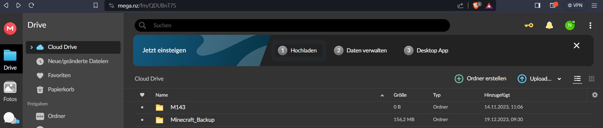
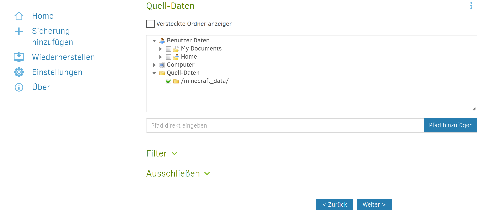

# Use-Case
In meinem Fall habe ich um meinen Minecraft Server zu Sichern, ein Vollbackup Konzept benutzt. Diese Methode war für mich die Logischte und zugleich effektivste lösung, da alle meine Daten von der Minecraft Welt unabhänging von Grösse oder SpeicherTyp gespeichert werden. Das heisst alle Daten werden gespeichert und ich muss mir keine Gedanken machen, dass Items in dem Spiel plötzlich gelöscht werden.


Unteranderem halte ich das Wiederherstellungssystem von einem Vollbackup für schnell und effizient. Falls jemals Daten gelöscht werden oder es einen Systemabsturz gibt, kann ich mit wenig Aufwand alles wiederherstellen, ohne auf mehrere Inkremental- oder differentielle Backups angewiesen zu sein.

Unteranderem Falls ich ein Grosses und Zeitaufwädiges Minecraft Projekt starte, kann ich durch das Vollbackup die Langzeitarchivierung meiner Daten Garantieren. 
	

Zusätzlich sollte ich Elemente aus der Gebührenverordnung für Maßnahmen im Bereich der öffentlichen Sicherheit und Ordnung (GebüV), dem Datenschutzgesetz und den BSI-IT-Grundschutz-Vorgaben. Dies hiess für mich, dass meine Backup-Strategie auch rechtlich im grünen berreich sein musste. Es ist wichtig sicherzustellen, dass personenbezogene Daten gemäß den Datenschutzbestimmungen geschützt sind. Dies war jedoch kein Problem für mich da ich keine Personenbezogenen Daten gespeichert habe. Trotzdem habe ich aus Sicherheitsgründen alle Backups mit AES verschlüsselt, dass nur Autohrisierte Personen Zugriff auf diese Daten haben. 


## Umgebungs Visualisierung 


Der Inhalt meines auftrages besteht darin, einen Backup Server für meinen Minecraft Server zu erstellen. Das Konzept wird auf Multipass ausgeführt. Die Backupdaten, also der Minecraft Spielstand wird mittels Duplicati auf dem Mega.nz gespeichert. Docker habe ich als zusatz genommen, damit ich die Daten Redundant speichern kann und es nicht nur im .NZ ist.

## VM via Multipass erstellen

Zuerst muss man Multipass installieren und alles vorbereiten. 


Danach kann ich sagen, was meine Multipass VM für eigenschaften haben sollte. Danach als die VM erstellt werden konnte, habe ich diese dierekt mal gestartet.
```yaml
multipass launch -c2 -d 70G -m 4G -n m143 docker 
```
```yaml
multipass.exe shell m143
```

-c2 = anzahl Kernel der VM \
-d 70G = Grösse der Virtuelen Festplatte \
-m 4G = Anzahl Gb Ram von VM \
-n m143 = Name der VM \
docker = Docker soll auf der VM noch installiert werden

# Docker vorbereiten

Bevor ich irgend etwas mit Docker wirkich anfange, wollte ich zuerst ein *sudo arp-get update* machen um alles ausgeführte zu aktuallisieren um auf dem neusten Stand zu sein. 


Nachdem alles aktuallisiert hat, installiere ich noch zusätzliche Paktete für Docker. Zum einen hol ich mir die benötigten Zertifikate und dazu noch die KEYS 
```yaml
sudo apt-get install ca-certificates curl gnupg
```
```yaml
sudo install -m 0755 -d /etc/apt/keyrings
curl -fsSL https://download.docker.com/linux/ubuntu/gpg | sudo gpg --dearmor -o /etc/apt/keyrings/docker.gpg
sudo chmod a+r /etc/apt/keyrings/docker.gpg
```


Bei dem nächsten befehl musste man das Repository erstellen und es zu der apt source (liste) hinzufügen. 
```yaml
echo \
  "deb [arch="$(dpkg --print-architecture)" signed-by=/etc/apt/keyrings/docker.gpg] https://download.docker.com/linux/ubuntu \
  "$(. /etc/os-release && echo "$VERSION_CODENAME")" stable" | \
  sudo tee /etc/apt/sources.list.d/docker.list > /dev/null
sudo apt-get update
```


Jetzt noch diese Plugins installieren und dann ist man fast fertig mit der installation. Diese Zusatzprogramme werden wir noch brauchen. 
```yaml
sudo apt-get install docker-ce docker-ce-cli containerd.io docker-buildx-plugin docker-compose-plugin
```


Um sicher zu gehen, dass alles nötige funktioniert hat und richtig installiert wurde, kann man noch diesen Befehl ausführen(Optional):
```yaml
Docker --help
```

Der letzte schritt der installierung ist es die Ordner für die Daten zu erstellen, die in der Datenbank dan schlussendlich gespeichert werden.

```yaml
mkdir minecraft_data 

mkdir -p duplicati/appdata

mkdir -p duplicati/backups

mkdir -p duplicati/source
```
Dublicati


Wenn du dein Docker jetzt starten willst, musst du noch das Compose File mit den Konfigs von Duplicati und dem Minecraft Server erstellen. Die Anleitung wie ich dies gemacht habe wird hier verlinkt. Genauso kann man sich einfach das NANO file von mir kopieren. 

https://docs.linuxserver.io/images/docker-duplicati/#usage

```yaml
version: "3.7"
services:
  mc:
    image: itzg/minecraft-server
    tty: true
    stdin_open: true
    ports:
      - "25565:25565"
    environment:
      EULA: "TRUE"
    volumes:
      - /home/ubuntu/minecraft_data:/data
  duplicati:
    image: lscr.io/linuxserver/duplicati:latest
    container_name: duplicati
    environment:
      - PUID=1000
      - PGID=1000
      - TZ=Etc/UTC
    volumes:
      - /home/ubuntu/duplicati/appdata/config:/config
      - /home/ubuntu/duplicati/backups:/backups
      - /home/ubuntu/duplicati/source:/source
      - /home/ubuntu/minecraft_data:/minecraft_data
    ports:
      - 8200:8200
    restart: unless-stopped
```
Nachdem du das alles installiert hast, solltest du bereit sein, Jetzt Docker zu starten.

## Debug in Vorbereitung

Wäred des aufsetzten, sties ich auf ein paar probleme, die mir die Installation von Docker nicht gerade erleichtert hat. Um den Aufbau der Doku trotzdem flüsslig zu halten, werde ich in diesem Absatz mich auf das Debugging beziehn und aufzeigen wie etwas gelöst habe, dass nicht funktionierte.

Als ich das erste mal probiert habe, den Docker zu starten bekam ich einen Fehler. Bei der Installation, hatte es das Server.jar file nicht heruntergeladen.


Als erstes habe ich alle Docker Files gelöscht und nochmal installiert. Dies funktionierte jedoch wieder nicht und ich bekam eine Fehlermeldung. 

Der richtige Lösungsansatz war es, wieder alles zu löschen.
Jetzt musste ich selber das File Server.jar von hand installieren. Nachdem ich die Docker Files wieder installiert habe, hat die automatische Installation den Server.jar teil übersprungen, da das file schon existierte. Danach funktionierte alles wieder
## Docker Starten

Um Docker zum ersten mal zu starten, füge diesen code ein:

```yaml
sudo docker compose up -d
```
*-d = Um Docker im hintergrund laufen zu lassen*

Wenn alles geklappt hat, sollte dein Screen jetzt so aus sehen 


Danach führe *Multipass list* aus um die IP von M143 zu sehen. Speichere dir diese IP. Danach gehe zu deinem Compose file und **kopiere von ganz unten den Port**. Danach gehst du auf safari und verbindest dich mit diesen angaben. 


## Speicherort einrichten MEGA.NZ

Nun um unsere minecraft Daten auch speichern zu können, brauchen wir dafür einen Speicherort. Ich habe mich persönlich für mega.nz entschieden, da es am umkompliziertesten ist. 

Erstelle einen Backup ordner und bennene ihn *minecraft_backup*




Jetzt musst du deine Cloud nur noch mit deinem Backup system verbinden so das die Server Daten alle auf dem Mega.nz Ordner gespeichert werden. Gehe dafür auf Duplicati und füge eine sicherung hinzu. Fülle nun die Felder so wie im gezeigten Bilder aus. 


Jetzt musst du nurnoch den richtigen Ordner wählen, wo das gespeichert werden sollte, und dann kannst du gelich mal den Server in Betrieb nehmen und testen ob es funktioniert. 



## Minecraft Server starten und Testen

Mache wieder *Sudo docker compose up -d* und melde dich bei Minecraft an. Und verbinnde dich auf einen Server. Gib nun als Server IP deine IP ein, die du schon bei Duplicati benutzt hast.

## Beweise das es Funktioniert

Um zu zeigen, dass es den Spielinhalt wirklich gespeichert hat, kann ich auf meinen Mega Ordner gehen und sehen ob sich dort Dateien befinden.

Wie gut auf dem Bild zu erkennen ist, hat Duplicati automatisch die Spielinhalte gespeichert, so wie erhofft. 


Auch habe ich dies noch In-game getestet. Ich habe in Minecraft einen Block gebaut. Danach habe ich mich aus und wieder eingeloggt um zu sehen ob er noch dort steht. Und ja er war noch da, was hies der Server hat ein Backup gemacht.


## Recovery Lösung

Diesen Teil habe ich in diesem MD geschrieben. : 

