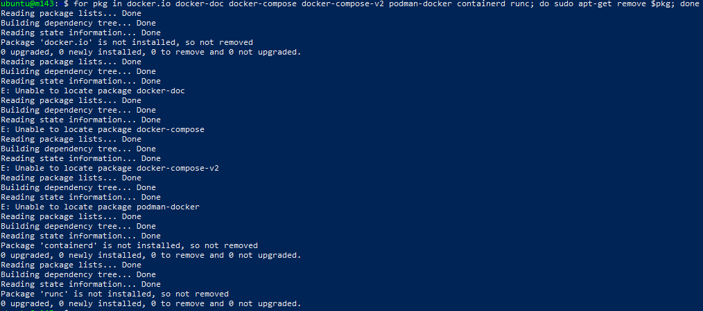

**Auftrag**

## CMD 
*multipass install*

# In Powershell:

 -multipass launch -c 2 -d 70G -m 4G -n m143 lts

 -multipass.exe shell m143

 -for pkg in docker.io docker-doc docker-compose docker-compose-v2 podman-docker containerd runc; do sudo apt-get remove $pkg; done

# Add Docker's official GPG key:
sudo apt-get update
sudo apt-get install ca-certificates curl gnupg
sudo install -m 0755 -d /etc/apt/keyrings
curl -fsSL https://download.docker.com/linux/ubuntu/gpg | sudo gpg --dearmor -o /etc/apt/keyrings/docker.gpg
sudo chmod a+r /etc/apt/keyrings/docker.gpg

# Add the repository to Apt sources:
echo \
  "deb [arch="$(dpkg --print-architecture)" signed-by=/etc/apt/keyrings/docker.gpg] https://download.docker.com/linux/ubuntu \
  "$(. /etc/os-release && echo "$VERSION_CODENAME")" stable" | \
  sudo tee /etc/apt/sources.list.d/docker.list > /dev/null
sudo apt-get update

# Docker und zusatzprogramme Installieren

sudo apt-get install docker-ce docker-ce-cli containerd.io docker-buildx-plugin docker-compose-plugin

(Optional: Docker --help)<-- Test ob alles Funktioniert hat

# Ordner erstellen wo Daten der Datenbank gespeichert werden

mkdir minecraft_data 

mkdir -p duplicati/appdata

mkdir -p duplicati/backups

mkdir -p duplicati/source

# Docker Testen
sudo docker compose up

# Optionale Schritte

Um zu testen ob es wirklich funktioniert hat, könnte ich jetz meinen minecraftserver aufsetzten.
Dafür müsste ich Minecraft installieren und dann auf dem Client meinen Server verbinnden

# Firewall Configuration

-ufw

-sudo ufw status$

-sudo ufw allow http

-sudo ufw allow https

-sudo ufw allow ssh

-sudo ufw allow 8090/tcp

-sudo ufw enable 

