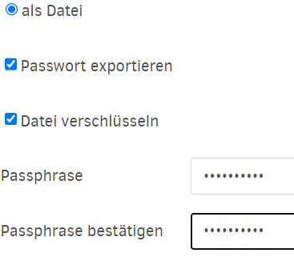
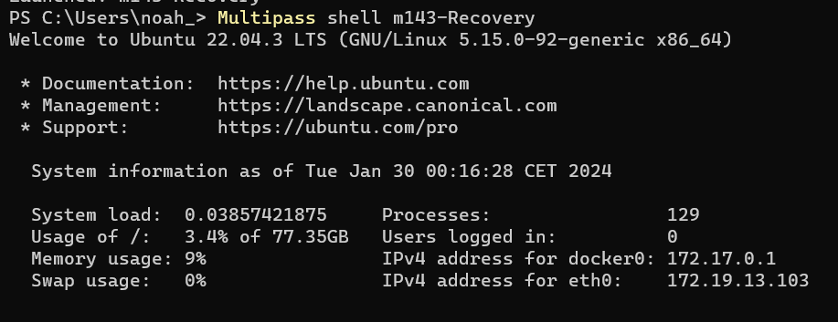
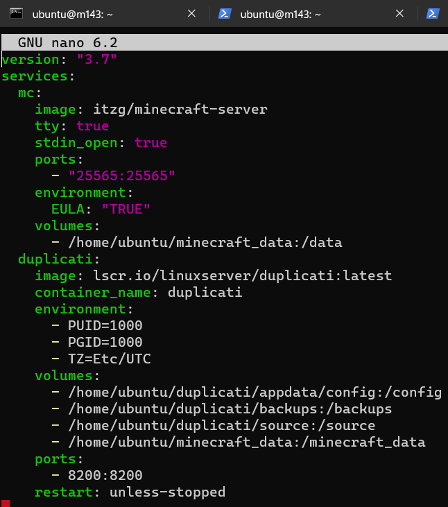
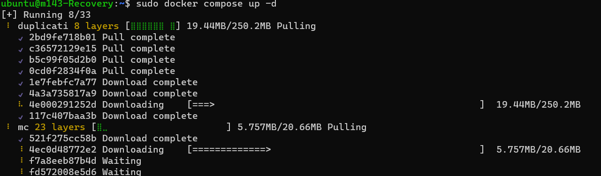
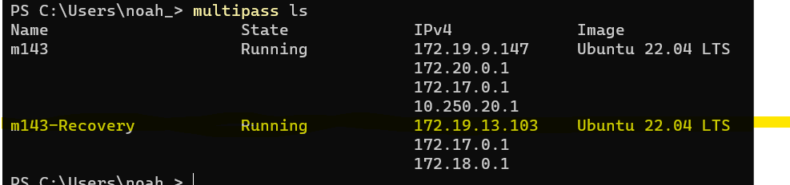
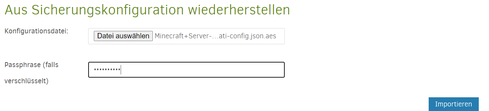
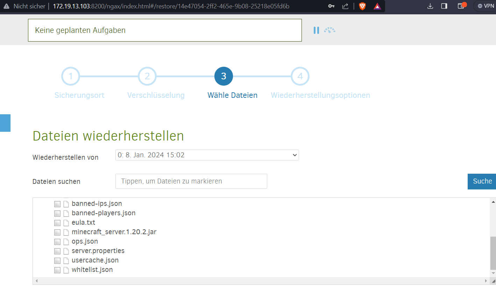
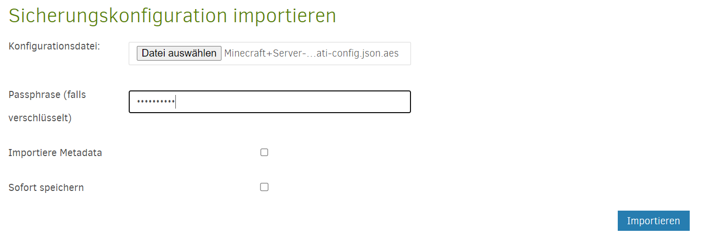
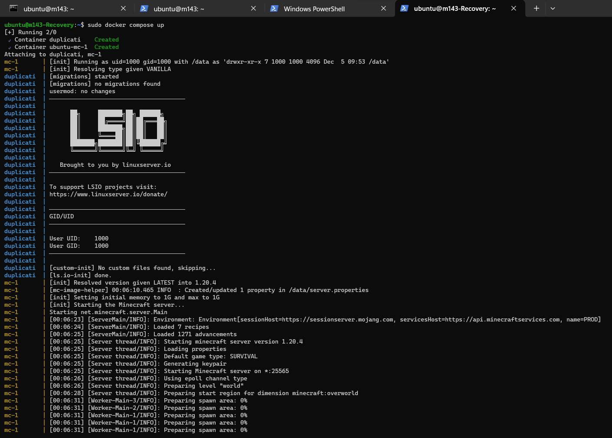
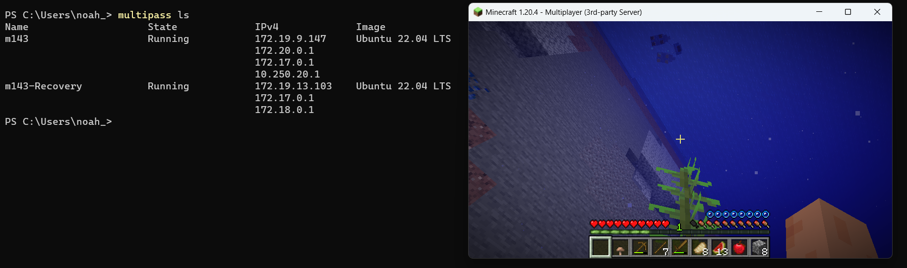

## Recovery Einleitung

Jetzt nachdem ich den Backup Teil erledigt habe, muss jetzt noch eine Recovery Mode hinzugefügt werden. Im falle eines Kompletten Datenverlustes, sollen die Daten Trotzdem noch gespeichert werden.

Kleine Basics zum starten
Multipass shell (VM-Name) = Um VM zu starten
Sudo docker compose up -d = Docker Starten


# Zur durchführung

Als erstes habe ich alles nötige (Multipass shell, Docker) Gestartet und mich dann mit Duplicati verbuden.
Danach Klappe bei deinem Minecraft Server die Optionen auf und wähle Exportieren. Danach habe ich mich für für "als Datei" exportieren entschieden. Dazu habe ich aus Sicherheits Gründen die Datei noch verschlüsselt (Haken anklicken)




Danach Ladest du die .AES Datei herunter. Nun haben wir die benötigte Datei um einen Recovery zu machen. 

## VM Erstellen

Im diesem Teil des Prozesses werde ich eine neue VM erstellen. Wir gehen davon aus, dass alle unsere Daten und Backups gelöscht worden sind und wir somit bei Null beginnen müssen. Daher haben wir nun die Aufgabe eine Komplett neue VM einzurichten und sämtliche Konfigurationen von Grund auf neu aufbauen und sicheustellen, dass alle notwendigen Ressourcen und Einstellungen reibungslos laufen um eine Funktionalität zu gewährleisten.

Meine VM nenne ich 143-recovery. so lautet der code um die VM zu erstellen:
```yaml
Multipass launch -c4 -d 80G -m 4G -n m143-Recovery docker
```



Nach dem du deine VM gestartet Hast, nimm das docker-compose file von dem Arbeitsbuch.md und füge es wieder im Nano Modus hinzu. 


Danach kannst du dein Docker Starten. 
Wenn es danach so aussieht, hast du bis jetzt alles richtig gemacht. 



Um nun auf Duplicati zu kommen, führe Multipass Ls auf einem neuen Terminal aus und füge die Markierte IP wie vorgegeben in den Browser rein

*192.168.1.0:8200*


In Duplicati gehe zu "Wiederherstellen", wähle "Aus Konfiguration wiederherstellen" aus und füge die vorhin heruntergeladene .json.aes Datei ein.
Falls du deine Datei verschlüsselt hast, musst du noch deinen Phrase eingeben. Danach ist alles Automatisch ausgefüllt, heisst klicke weiter bis "Sicherungsdaten werden aufgelistet..." kommt.


Nun müssen wir nocheinmal bestätigen, da die Voreinstellungen zur Datenspeicherung für mich passt. 


Hier einfach auf "Wiederherstellen" Drücken und wir haben es geschafft. Jetz Ladet es noch für eine kurze zeit und schon hast du dein Recovery durchgeführt.  


Das letzte was du tun musst ist, die Backup Datei wieder hinzufügen. Unter Sicherungen Hinzufügen dann von Datei exportieren wählen und Datei hinzufügen.


## Test Phase

Um zu schauen ob es Funktioniert hat und meine Minecraft Welt noch steht wird jetzt getestet. 
Im CMD scheit alles zu funktionieren wenn Docker gestartet wird. Die Minecraft Welt Läd wie man unten sehen kann




Danach bin ich noch in Minecraft rein und hab mich mit der IP auf den Server verbunden. Tatsächlich habe ich meinen Spielstand noch, was heisst, das es Funktioniert hat. 
